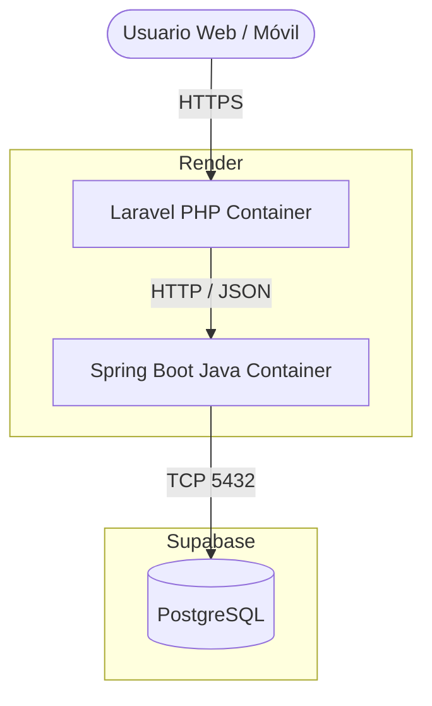
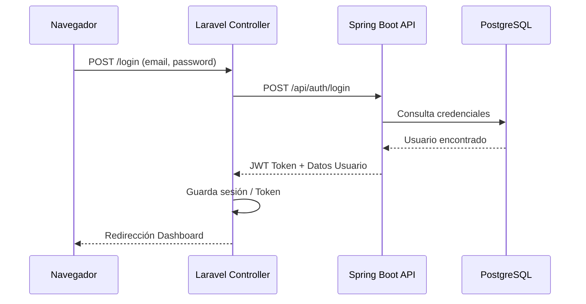

# Diagramas de Arquitectura

## Diagrama de Despliegue (Render + Supabase)

```mermaid
graph TD
    subgraph Render
        Frontend[Laravel PHP Container]
        Backend[Spring Boot Java Container]
    end

    subgraph Supabase
        DB[(PostgreSQL)]
    end

    Client([Usuario Web / Móvil]) -->|HTTPS| Frontend
    Frontend -->|HTTP / JSON| Backend
    Backend -->|TCP 5432| DB
```

## Diagrama de Comunicación Interna (Login)

```mermaid
sequenceDiagram
    participant User as Navegador
    participant Laravel as Laravel Controller
    participant Java as Spring Boot API
    participant DB as PostgreSQL

    User->>Laravel: POST /login (email, password)
    Laravel->>Java: POST /api/auth/login
    Java->>DB: Consulta credenciales
    DB-->>Java: Usuario encontrado
    Java-->>Laravel: JWT Token + Datos Usuario
    Laravel->>Laravel: Guarda sesión / Token
    Laravel-->>User: Redirección Dashboard
```
